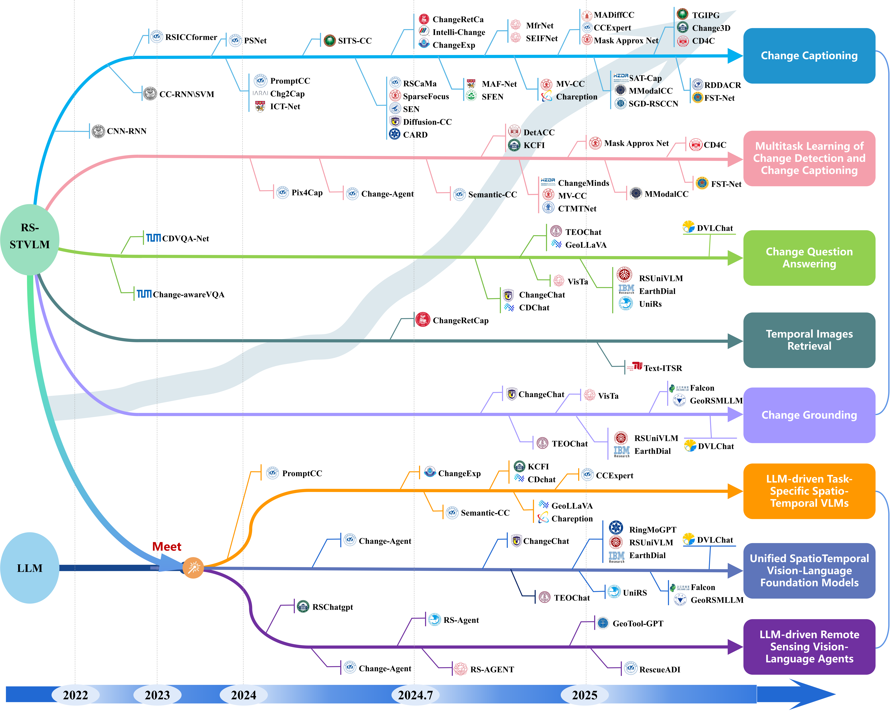

[](https://github.com/sindresorhus/awesome)
[](https://github.com/Chen-Yang-Liu/RS-Temporal-VLM/pulls)
<br />
<p align="center">
  <h1 align="center">Remote Sensing Spatio-Temporal Vision-Language Models: A Comprehensive Survey</h1>
  <p align="center">
    <br />
    <a href="https://chen-yang-liu.github.io/"><strong>Chenyang Liu </strong></a>
    ·
    <a href="https://levir.buaa.edu.cn/members/index.html"><strong> Jiafan Zhang </strong></a>
    ·
    <a href="https://chenkeyan.top/"><strong> Keyan Chen </strong></a>
    ·
    <a href="https://levir.buaa.edu.cn/members/index.html"><strong> Man Wang </strong></a>
    ·
    <a href="https://scholar.google.com/citations?user=DzwoyZsAAAAJ"><strong> Zhengxia Zou </strong></a>
    ·   
    <a href="https://scholar.google.com/citations?user=kNhFWQIAAAAJ"><strong> Zhenwei Shi*✉ </strong></a>
    
  
  </p>

  <p align="center">
    <a href='https://arxiv.org/abs/2412.02573'>
      
    </a>
<!--     <a href='https://ieeexplore.ieee.org/document/'>
      
    </a> -->
  </p>
<br />


This repo is used for recording, and tracking recent Remote Sensing Spatio-Temporal Vision-Language Models (RS-STVLMs). If you find any work missing or have any suggestions (papers, implementations, and other resources), feel free to [pull requests](https://github.com/Chen-Yang-Liu/RS-Temporal-VLM/pulls).

### :star: Share us a :star:
Share us a :star: if you're interested in this repo. We will continue to track relevant progress and update this repository.

### 🙌 Add Your Paper in our Repo and Survey!

- You are welcome to give us an issue or PR for your RS-STVLM work !!!!! We will record it for next version update of our survey


### 🥳 News

🔥🔥🔥 The rep is updating 🔥🔥🔥

[//]: # (- **2024.12.04**: The first version is available.)


### ✨ Highlight!!

✅ The first survey for Remote Sensing Spatio-Temporal Vision-Language Models.

✅ Some public datasets and code links are provided. 

✅ We will **continue to track related work** in this repository. 


## 📖 Introduction

Timeline of RS-STVLMs:



## 📖 Table of Contents
- [📚 Remote Sensing Spatio-Temporal Vision-language Tasks and Methods](#methods-a-survey)
  - [Change Captioning](#change-captioning)
  - [Multitask Learning of Change Detection and Change Captioning](#Multitask-Learning-of-Change-Detection-and-Change-Captioning)
  - [Change Question Answeringg](#change-question-answering)
  - [Text-driven Temporal Images Retrieval](#Text-driven-Temporal-Images-Retrieval)
  - [Change Grounding](#Change-Grounding)
  - [Text-driven Temporal Images Generation](#Text-driven-Temporal-Images-Generation)
  - ......
- [👨‍🏫 Large Language Models Meets Temporal Images](#Large-Language-Models-Meets-Temporal-Images)
  - [LLM-driven Task-Specific Spatio-Temporal VLMs](#LLM-driven-Task-Specific-Spatio-Temporal-VLMs)
  - [Unified Spatio-Temporal Vision-Language Foundation Models](#Unified-Spatio-Temporal-Vision-Language-Foundation-Models)
  - [LLM-driven Remote Sensing Vision-Language Agents](#LLM-driven-Remote-Sensing-Vision-Language-Agents)
  - ......
- [🛰️ Dataset](#Dataset)
  - [Matching Temporal Images, Text, and Masks](#Dataset_1)  
  - [Matching Temporal Images, Instruction and Response](#Dataset_2)
  - ......
- [💻 Others](#Others) 
- [🖊️ Citation](#Citation)
- [🐲 Contact](#Contact)

## 📚 Remote Sensing Spatio-Temporal Vision-language Tasks and Methods <a id="methods-a-survey"></a>
### Change Captioning 
|  Time   |   Model Name    | Paper Title                                                                                                                                                                            |    Visual Encoder     |         Language Decoder          |                    Code/Project                    |    
|:-------:|:---------------:|----------------------------------------------------------------------------------------------------------------------------------------------------------------------------------------|:---------------------:|:---------------------------------:|:--------------------------------------------------:|
| 2021.10 |     CNN-RNN     | [Captioning changes in bi-temporal remote sensing images](https://ieeexplore.ieee.org/abstract/document/9554419)                                                                       |        VGG-16         |                RNN                |                        N/A                         |
| 2022.08 |   CC-RNN/SVM    | [Change captioning: A new paradigm for multitemporal remote sensing image analysis](https://ieeexplore.ieee.org/abstract/document/9847254)                                             |        VGG-16         |              RNN,SVM              |                        N/A                         |
| 2022.11 |   RSICCformer   | [Remote sensing image change captioning with dual-branch transformers: A new method and a large scale dataset](https://ieeexplore.ieee.org/document/9934924)                           |      ResNet-101       |        Transformer Decoder        |   [link](https://github.com/Chen-Yang-Liu/RSICC)   |
| 2023.07 |      PSNet      | [Progressive Scale-aware Network for Remote sensing Image Change Captioning](https://ieeexplore.ieee.org/abstract/document/10283451)                                                   |       ViT-B/32        |        Transformer Decoder        |   [link](https://github.com/Chen-Yang-Liu/PSNet)   |
| 2023.10 |    PromptCC     | [A Decoupling Paradigm with Prompt Learning for Remote Sensing Image Change Captioning](https://ieeexplore.ieee.org/document/10271701)                                                 |       ViT-B/32        |               GPT-2               | [link](https://github.com/Chen-Yang-Liu/PromptCC)  |
| 2023.11 |     Chg2Cap     | [Changes to Captions: An Attentive Network for Remote Sensing Change Captioning](https://ieeexplore.ieee.org/abstract/document/10305516)                                               |      ResNet-101       |        Transformer Decoder        |  [link](https://github.com/ShizhenChang/Chg2Cap)   |
| 2023.11 |     ICT-Net     | [Interactive Change-Aware Transformer Network for Remote Sensing Image Change Captioning](https://www.mdpi.com/2072-4292/15/23/5611)                                                   |      ResNet-101       |        Transformer Decoder        |     [link](https://github.com/caicch/ICT-Net)      |
| 2024.03 |     SITS-CC     | [Change Caption for Satellite Images Time Series](https://ieeexplore.ieee.org/abstract/document/10485459)                                                                              |      ResNet-101       |        Transformer Decoder        |    [link](https://github.com/Crueyl123/SITSCC)     |
| 2024.05 |     RSCaMa      | [RSCaMa: Remote Sensing Image Change Captioning with State Space Model](https://ieeexplore.ieee.org/document/10537177)                                                                 |       ViT-B/32        | Mamba, Transformer Decoder, GPT-2 |  [link](https://github.com/Chen-Yang-Liu/RSCaMa)   |
| 2024.05 |   SparseFocus   | [A Lightweight Sparse Focus Transformer for Remote Sensing Image Change Captioning](https://arxiv.org/abs/2405.06598)                                                                  |      ResNet-101       |        Transformer Decoder        | [link](https://github.com/sundongwei/SFT_chag2cap) |
| 2024.05 |       SEN       | [Single-stream Extractor Network with Contrastive Pre-training for Remote Sensing Change Captioning](https://ieeexplore.ieee.org/abstract/document/10530145)                           | ResNet with 6-channel |        Transformer Decoder        |       [link](https://github.com/mrazhou/SEN)       |
| 2024.05 | Diffusion-RSCC  | [Diffusion model for learning cross-modal data distribution](https://arxiv.org/abs/2405.12875)                                                                                         |      ResNet-101       |             Diffusion             |  [link](https://github.com/Fay-Y/Diffusion-RSCC)   |
| 2024.05 |      CARD       | [Context-aware Difference Distilling for Multi-change Captioning](https://arxiv.org/abs/2405.20810)                                                                                    |      ResNet-101       |        Transformer Decoder        |      [link](https://github.com/tuyunbin/CARD)      |
| 2024.06 |  ChangeRetCap   | [Towards a multimodal framework for remote sensing image change retrieval and captioning](https://arxiv.org/abs/2406.13424)                                                            |      ResNet-101       |        Transformer Decoder        |   [link](https://github.com/rogerferrod/RSICRC)    |
| 2024.06 | Intelli-Change  | [Intelli-Change Remote Sensing - A Novel Transformer Approach](https://ieeexplore.ieee.org/document/10594026)                                                                          |      ResNet-101       |        Transformer Decoder        |                        N/A                         |
| 2024.06 |    ChangeExp    | [Towards Temporal Change Explanations from Bi-Temporal Satellite Images](https://arxiv.org/abs/2407.09548)                                                                             |       LLaVA-1.5       |             LLaVA-1.5             |                        N/A                         |
| 2024.07 |     MAF-Net     | [Multi-scale Attentive Fusion Network for Remote Sensing Image Change Captioning](https://ieeexplore.ieee.org/document/10558583)                                                       |      ResNet-101       |        Transformer Decoder        |                        N/A                         |
| 2024.07 |      SFEN       | [Scale-wised feature enhancement network for change captioning of remote sensing images](https://www.tandfonline.com/doi/abs/10.1080/01431161.2024.2380544)                            |      WideResNet       |        Transformer Decoder        |                        N/A                         |
| 2024.09 |     MfrNet      | [MfrNet: A New Multi-Scale Feature Refining Method for Remote Sensing Image Change Captioning](https://ieeexplore.ieee.org/document/10640584)                                          |       ResNet-18       |        Transformer Decoder        |                        N/A                         |
| 2024.09 |     SEIFNet     | [Inter-Temporal Interaction and Symmetric Difference Learning for Remote Sensing Image Change Captioning](https://ieeexplore.ieee.org/abstract/document/10689474)                      |      ResNet-101       |        Transformer Decoder        |   [link](https://github.com/romanticLYP/TISDNet)   |
| 2024.10 |      MV-CC      | [MV-CC: Mask Enhanced Video Model for Remote Sensing Change Caption](https://arxiv.org/abs/2410.23946)                                                                                 |     InternVideo2      |        Transformer Decoder        |     [link](https://github.com/liuruixun/MV-CC)     |
| 2024.10 |   Chareption    | [Chareption: Change-Aware Adaption Empowers Large Language Model for Effective Remote Sensing Image Change Captioning](https://link.springer.com/chapter/10.1007/978-981-97-8493-6_24) |     CLIP ViT-L/14     |             LLaMA-7B              |                        N/A                         |
| 2024.11 |    MADiffCC     | [Remote Sensing Image Change Captioning Using Multi-Attentive Network with Diffusion Model](https://www.mdpi.com/2072-4292/16/21/4083)                                                 |       Diffusion       |        Transformer Decoder        |                        N/A                         |  
| 2024.11 |    CCExpert     | [CCExpert: Advancing MLLM Capability in Remote Sensing Change Captioning with Difference-Aware Integration and a Foundational Dataset](https://arxiv.org/abs/2411.11360)               |       Diffusion       |        Transformer Decoder        |   [link](https://github.com/Meize0729/CCExpert)    | 
| 2024.12 |       ---       | [Data Augmentation in Remote Sensing Image Change Captioning](https://ieeexplore.ieee.org/document/10773445/?arnumber=10773445)                                                        |       ViT-B/32        |        Transformer Decoder        |                        N/A                         | 
| 2024.12 | Mask Approx Net | [Mask Approximation Net: A Novel Diffusion Model Approach for Remote Sensing Change Captioning](http://arxiv.org/abs/2412.19179)                                                       |        ResNet         |        Transformer Decoder        |       [link](https://github.com/sundongwei)        | 
| 2025.01 |     SAT-Cap     | [Change Captioning in Remote Sensing: Evolution to SAT-Cap -- A Single-Stage Transformer Approach](http://arxiv.org/abs/2501.08114)                                                    |      ResNet-101       |        Transformer Decoder        |      [link](https://github.com/AI4RS/SAT-Cap)      | 
| 2025.01 |    MModalCC     | [Robust Change Captioning in Remote Sensing: SECOND-CC Dataset and MModalCC Framework](http://arxiv.org/abs/2501.10075)                                                                |      ResNet-101       |        Transformer Decoder        | [link](https://github.com/ChangeCapsInRS/SecondCC) | 
| 2025.01 |    SGD-RSCCN    | [Scene Graph and Dependency Grammar Enhanced Remote Sensing Change Caption Network (SGD-RSCCN)](https://aclanthology.org/2025.coling-main.144/)                                        |      ResNet-101       |        Transformer Decoder        |                        N/A                         |
| 2025.02 |      TGIPG      | [Image Editing based on Diffusion Model for Remote Sensing Image Change Captioning](https://ieeexplore.ieee.org/document/10868357/?arnumber=10868357)                                  |          //           |                //                 |                        N/A                         |
| 2025.03 |    Change3D     | [Change3D: Revisiting Change Detection and Captioning from A Video Modeling Perspective](http://arxiv.org/abs/2503.18803)                                                              |     X3D-L(video)      |        Transformer Decoder        |   [link](https://github.com/zhuduowang/Change3D)   | 
| 2025.03 |      CD4C       | [CD4C: Change Detection for Remote Sensing Image Change Captioning](https://ieeexplore.ieee.org/document/10938120/?arnumber=10938120)                                                  |      ResNet-101       |        Transformer Decoder        |                        N/A                         |
| 2025.04 |     RDD+ACR     | [Region-aware Difference Distilling with Attribute-guided Contrastive Regularization for Change Captioning](https://ojs.aaai.org/index.php/AAAI/article/view/32517)                    |      ResNet-101       |        Transformer Decoder        |                        N/A                         | 
| 2025.04 |     FST-Net     | [Frequency–Spatial–Temporal Domain Fusion Network for Remote Sensing Image Change Captioning](https://www.mdpi.com/2072-4292/17/8/1463)                                                |       Segformer       |        Transformer Decoder        |                        N/A                         |
| 2025.06 |       CTM       | [Cross-Temporal Remote Sensing Image Change Captioning: A Manifold Mapping and Bayesian Diffusion Approach for Land Use Monitoring](https://ieeexplore.ieee.org/abstract/document/11021286)                                                |         CLIP          |        Transformer Decoder        |                        N/A                         |
| ........ 

### Multitask Learning of Change Detection and Change Captioning
|  Time   |   Model Name    | Paper Title                                                                                                                                                     |  Visual Encoder  |  Language Decoder   |                     Code/Project                      |
|:-------:|:---------------:|-----------------------------------------------------------------------------------------------------------------------------------------------------------------|:----------------:|:-------------------:|:-----------------------------------------------------:|
| 2024.01 |     Pix4Cap     | [Pixel-Level Change Detection Pseudo-Label Learning for Remote Sensing Change Captioning](https://arxiv.org/abs/2312.15311)                                     |     ViT-B/32     | Transformer Decoder | [link](https://github.com/Chen-Yang-Liu/Change-Agent) |
| 2024.03 |  Change-Agent   | [Change-Agent: Toward Interactive Comprehensive Remote Sensing Change Interpretation and Analysis](https://ieeexplore.ieee.org/abstract/document/10591792)      |     ViT-B/32     | Transformer Decoder | [link](https://github.com/Chen-Yang-Liu/Change-Agent) |
| 2024.07 |   Semantic-CC   | [Semantic-CC: Boosting Remote Sensing Image Change Captioning via Foundational Knowledge and Semantic Guidance](https://arxiv.org/abs/2407.14032)               |       SAM        |       Vicuna        |                          N/A                          |
| 2024.09 |    DetACC *     | [Detection Assisted Change Captioning for Remote Sensing Image](https://ieeexplore.ieee.org/document/10640971)                                                  |    ResNet-101    | Transformer Decoder |                          N/A                          |
| 2024.09 |      KCFI       | [Enhancing Perception of Key Changes in Remote Sensing Image Change Captioning](https://arxiv.org/abs/2409.12612)                                               |       ViT        |        Qwen         |      [link](https://github.com/yangcong356/KCFI)      |
| 2024.10 |     MV-CC *     | [MV-CC: Mask Enhanced Video Model for Remote Sensing Change Caption](https://arxiv.org/abs/2410.23946)                                                          |   InternVideo2   | Transformer Decoder |      [link](https://github.com/liuruixun/MV-CC)       |
| 2024.10 |   ChangeMinds   | [ChangeMinds: Multi-task Framework for Detecting and Describing Changes in Remote Sensing](https://arxiv.org/abs/2410.10047)                                    | Swin Transformer | Transformer Decoder |    [link](https://github.com/Y-D-Wang/ChangeMinds)    |
| 2024.10 |     CTMTNet     | [A Multi-Task Network and Two Large Scale Datasets for Change Detection and Captioning in Remote Sensing Images](https://ieeexplore.ieee.org/document/10740028) |    ResNet-101    | Transformer Decoder |                          N/A                          |
| 2024.12  | Mask Approx Net | [Mask Approximation Net: A Novel Diffusion Model Approach for Remote Sensing Change Captioning](http://arxiv.org/abs/2412.19179)                                |      ResNet      | Transformer Decoder |         [link](https://github.com/sundongwei)         | 
| 2025.01  |   MModalCC *    | [Robust Change Captioning in Remote Sensing: SECOND-CC Dataset and MModalCC Framework](http://arxiv.org/abs/2501.10075)                                         |    ResNet-101    | Transformer Decoder |  [link](https://github.com/ChangeCapsInRS/SecondCC)   | 
| 2025.03  |     CD4C *      | [CD4C: Change Detection for Remote Sensing Image Change Captioning](https://ieeexplore.ieee.org/document/10938120/?arnumber=10938120)                           | ResNet-101       | Transformer Decoder |                                     N/A               |
| 2025.04  |     FST-Net     | [Frequency–Spatial–Temporal Domain Fusion Network for Remote Sensing Image Change Captioning](https://www.mdpi.com/2072-4292/17/8/1463)                         |    Segformer     | Transformer Decoder |                          N/A                          |
| ......  

### Change Question Answering
|  Time   |    Model Name    | Paper Title                                                                                                                                      |   Visual Encoder   |     Language Decoder      |                     Code/Project                     |
|:-------:|:----------------:|--------------------------------------------------------------------------------------------------------------------------------------------------|:------------------:|:-------------------------:|:----------------------------------------------------:|
| 2022.07 | change-aware VQA | [Change-Aware Visual Question Answering](https://ieeexplore.ieee.org/document/9884801)                                                           |        CNN         |            RNN            |                         N/A                          |
| 2022.09 |    CDVQA-Net     | [Change Detection Meets Visual Question Answering](https://ieeexplore.ieee.org/document/9901476)                                                 |        CNN         |            RNN            |     [link](https://github.com/YZHJessica/CDVQA)      |
| 2024.09 |    ChangeChat    | [ChangeChat: An Interactive Model for Remote Sensing Change Analysis via Multimodal Instruction Tuning](https://arxiv.org/abs/2409.08582)        |      CLIP-ViT      |        Vicuna-v1.5        |    [link](https://github.com/hanlinwu/ChangeChat)    |
| 2024.09 |      CDchat      | [CDChat: A Large Multimodal Model for Remote Sensing Change Description](https://arxiv.org/abs/2409.16261)                                       |   CLIP ViT-L/14    |        Vicuna-v1.5        |       [link](https://github.com/techmn/cdchat)       |
| 2024.10 |     TEOChat      | [TEOChat: A Large Vision-Language Assistant for Temporal Earth Observation Data](https://arxiv.org/abs/2410.06234)                               |   CLIP ViT-L/14    |          LLaMA-2          |    [link](https://github.com/ermongroup/TEOChat)     |
| 2024.10 |     GeoLLaVA     | [GeoLLaVA: Efficient Fine-Tuned Vision-Language Models for Temporal Change Detection in Remote Sensing](https://arxiv.org/abs/2410.19552)        |   Video encoder    |  LLaVA-NeXT, Video-LLaVA  |     [link](https://github.com/HosamGen/GeoLLaVA)     |
| 2024.10 |      VisTA       | [Show Me What and Where has Changed?  Question Answering and Grounding for Remote Sensing Change Detection](https://arxiv.org/abs/2410.23828)    | CLIP image Encoder |     CLIP Text Encoder     |       [link](https://github.com/like413/VisTA)       |
| 2024.12 |     RSUniVLM     | [RSUniVLM: A Unified Vision Language Model for Remote Sensing via Granularity-oriented Mixture of Experts](http://arxiv.org/abs/2412.05679)      |    Siglip-400m     |        Qwen2-0.5B         |   [link](https://github.com/xuliu-cyber/RSUniVLM)    |
| 2024.12 |    EarthDial     | [EarthDial: Turning Multi-sensory Earth Observations to Interactive Dialogues](http://arxiv.org/abs/2412.15190)                                  |   InternViT-300M   |        Phi-3-mini         |     [link](https://github.com/hiyamdebary/EarthDial)                 |
| 2024.12 |      UniRS       | [UniRS: Unifying Multi-temporal Remote Sensing Tasks through Vision Language Models](http://arxiv.org/abs/2412.20742)                            |    Siglip-400m     |     Sheared-LLAMA-3B      |   [link](https://github.com/IntelliSensing/UniRS)    |
| 2025.05 |     DVLChat      | [DynamicVL: Benchmarking Multimodal Large Language Models for Dynamic City Understanding](https://arxiv.org/abs/2505.21076)  |   SAM         |         Qwen2.5-VL        |                         N/A                          |
| ......  
 

### Text-driven Temporal Images Retrieval
|   Time   |  Model Name  | Paper Title                                                                                                                 |                 Code/Project                  |
|:--------:|:------------:|-----------------------------------------------------------------------------------------------------------------------------|:---------------------------------------------:|
| 2024.06  | ChangeRetCap | [Towards a multimodal framework for remote sensing image change retrieval and captioning](https://arxiv.org/abs/2406.13424) | [link](https://github.com/rogerferrod/RSICRC) |
| 2025.01  |  text-ITSR   | [Self-Supervised Cross-Modal Text-Image Time Series Retrieval in Remote Sensing](http://arxiv.org/abs/2501.19043)           |                           N/A                 |
| ........ 


### Change Grounding
|   Time   | Model Name | Grounding Output | Paper Title                                                                                                                                   |                  Code/Project                  |
|:--------:|:----------:|:----------------:|-----------------------------------------------------------------------------------------------------------------------------------------------|:----------------------------------------------:|
| 2024.09  | ChangeChat |       mask       | [ChangeChat: An Interactive Model for Remote Sensing Change Analysis via Multimodal Instruction Tuning](https://arxiv.org/abs/2409.08582)     | [link](https://github.com/hanlinwu/ChangeChat) |
| 2024.10  |  TEOChat   |       bbox       | [TEOChat: A Large Vision-Language Assistant for Temporal Earth Observation Data](https://arxiv.org/abs/2410.06234)                            | [link](https://github.com/ermongroup/TEOChat)  |
| 2024.10  |   VisTA    |       mask       | [Show Me What and Where has Changed?  Question Answering and Grounding for Remote Sensing Change Detection](https://arxiv.org/abs/2410.23828) |    [link](https://github.com/like413/VisTA)    |
| 2024.12  |  RSUniVLM  |       mask       | [RSUniVLM: A Unified Vision Language Model for Remote Sensing via Granularity-oriented Mixture of Experts](http://arxiv.org/abs/2412.05679)   |    [link](https://github.com/xuliu-cyber/RSUniVLM)    |
| 2024.12  |  EarthDial |       bbox       | [EarthDial: Turning Multi-sensory Earth Observations to Interactive Dialogues](http://arxiv.org/abs/2412.15190)                               |                          N/A                          | 
| 2025.03  |    Falcon  |       mask       | [Falcon: A Remote Sensing Vision-Language Foundation Model](http://arxiv.org/abs/2503.11070)                                                  |     [link](https://github.com/TianHuiLab/Falcon)      | 
| 2025.03  |  GeoRSMLLM |       mask       | [GeoRSMLLM: A Multimodal Large Language Model for Vision-Language Tasks in Geoscience and Remote Sensing](http://arxiv.org/abs/2503.12490)    |            N/A                                        |
| ........ 

### Text-driven Temporal Images Generation
|  Time   | Model Name  | Paper Title                                                                                                                                               | Code/Project |
|:-------:|:-----------:|-----------------------------------------------------------------------------------------------------------------------------------------------------------|:------------:|
| 2025.02 |    TGIPG    | [Image Editing based on Diffusion Model for Remote Sensing Image Change Captioning](https://ieeexplore.ieee.org/document/10868357/?arnumber=10868357)  |     N/A      |
| 2025.05 |   WHU-GCD   | [Open-vocabulary generative vision-language models for creating a large-scale remote sensing change detection dataset](https://www.sciencedirect.com/science/article/pii/S0924271625001595)  |   [link](https://gpcv.whu.edu.cn/data/)   |
| ........ 

## 👨‍🏫 Large Language Models Meets Temporal Images

### LLM-driven Task-Specific Spatio-Temporal VLMs
|   Time   |   Method    | Paper Title                                                                                                                                                                            |      LLM      |     LLM     |  Fine-tuning  |                      Code/Project                      |
|:--------:|:-----------:|----------------------------------------------------------------------------------------------------------------------------------------------------------------------------------------|:-------------:|:-----------:|:-------------:|:------------------------------------------------------:|
| 2023.10  |  PromptCC   | [A Decoupling Paradigm with Prompt Learning for Remote Sensing Image Change Captioning](https://ieeexplore.ieee.org/document/10271701)                                                 | CLIP-ViT-B/32 |    GPT-2    | Prompt Tuning |   [link](https://github.com/Chen-Yang-Liu/PromptCC)    |
| 2024.06  |  ChangeExp  | [Towards Temporal Change Explanations from Bi-Temporal Satellite Images](https://arxiv.org/abs/2407.09548)                                                                             |  CLIP-ViT-L   |   LLaVA-1.5 | Prompt Method |                          N/A                           |
| 2024.07  | Semantic-CC | [Semantic-CC: Boosting Remote Sensing Image Change Captioning via Foundational Knowledge and Semantic Guidance](https://arxiv.org/abs/2407.14032)                                      |      SAM      |   Vicuna    |     LoRA      |                           N/A                          |
| 2024.09  |    KCFI     | [Enhancing Perception of Key Changes in Remote Sensing Image Change Captioning](https://arxiv.org/abs/2409.12612)                                                                      |      ViT      |    Qwen     | Prompt Tuning |      [link](https://github.com/yangcong356/KCFI)       |
| 2024.09  |   CDChat    | [CDChat: A Large Multimodal Model for Remote Sensing Change Description](https://arxiv.org/abs/2409.16261)                                                                             | CLIP-ViT-L/14 | Vicuna-v1.5 |     LoRA      |        [link](https://github.com/techmn/cdchat)        |
| 2024.10  |  GeoLLaVA   | [GeoLLaVA: Efficient Fine-Tuned Vision-Language Models for Temporal Change Detection in Remote Sensing](https://arxiv.org/abs/2410.19552)                                              |  Siglip-400m  | LLaVA-NeXT  |     LoRA      |      [link](https://github.com/HosamGen/GeoLLaVA)      |
| 2024.10  | Chareption  | [Chareption: Change-Aware Adaption Empowers Large Language Model for Effective Remote Sensing Image Change Captioning](https://link.springer.com/chapter/10.1007/978-981-97-8493-6_24) | CLIP-ViT-L/14 |  LLaMA-7B   |    Adapter    |                          N/A                           |
| 2024.11  |  CCExpert   | [CCExpert: Advancing MLLM Capability in Remote Sensing Change Captioning with Difference-Aware Integration and a Foundational Dataset](https://arxiv.org/abs/2411.11360)               |  Siglip-400m  |   Qwen-2    |     LoRA      |     [link](https://github.com/Meize0729/CCExpert)      |
| ........ 

### Unified Spatio-Temporal Vision-Language Foundation Models

|   Time   |    Method    | Paper Title                                                                                                                                                                 |        Visual Encoder         |     LLM     |    Fine-tuning    |                     Code/Project                      |
|:--------:|:------------:|-----------------------------------------------------------------------------------------------------------------------------------------------------------------------------|:------------------:|:-----------:|:-----------------:|:-----------------------------------------------------:|
| 2024.03  | Change-Agent | [Change-Agent: Toward Interactive Comprehensive Remote Sensing Change Interpretation and Analysis](https://ieeexplore.ieee.org/abstract/document/10591792)                  |     Segformer      |   Chatgpt   |      Frozen       | [link](https://github.com/Chen-Yang-Liu/Change-Agent) |
| 2024.09  |  ChangeChat  | [ChangeChat: An Interactive Model for Remote Sensing Change Analysis via Multimodal Instruction Tuning](https://arxiv.org/abs/2409.08582)                                   |      CLIP-ViT      | Vicuna-v1.5 |       LoRA        | [link](https://github.com/hanlinwu/ChangeChat)        |
| 2024.10  |   TEOChat    | [TEOChat: A Large Vision-Language Assistant for Temporal Earth Observation Data](https://arxiv.org/abs/2410.06234)                                                          |   CLIP ViT-L/14    |   LLaMA-2   |       LoRA        | [link](https://github.com/ermongroup/TEOChat)         |
| 2024.12  |  RingMoGPT   | [RingMoGPT: A Unified Remote Sensing Foundation Model for Vision, Language, and grounded tasks](https://ieeexplore.ieee.org/document/10777289/?arnumber=10777289)           | ViT-g/14(EVA-CLIP) | Vicuna-13B  |      Frozen       |                          N/A                          |
| 2024.12  |   RSUniVLM   | [RSUniVLM: A Unified Vision Language Model for Remote Sensing via Granularity-oriented Mixture of Experts](http://arxiv.org/abs/2412.05679)                                 |    Siglip-400m     | Qwen2-0.5B  |        MoE        | [link](https://github.com/xuliu-cyber/RSUniVLM)       |
| 2024.12  |  EarthDial   | [EarthDial: Turning Multi-sensory Earth Observations to Interactive Dialogues](http://arxiv.org/abs/2412.15190)                                                             |   InternViT-300M   |  Phi-3-mini| Fully Fine-tuning |          [link](https://github.com/hiyamdebary/EarthDial)             |
| 2024.12  |    UniRS     | [UniRS: Unifying Multi-temporal Remote Sensing Tasks through Vision Language Models](http://arxiv.org/abs/2412.20742)                                                       |    Siglip-400m     |    Sheared-LLAMA-3B | Fully Fine-tuning | [link](https://github.com/IntelliSensing/UniRS)       |
| 2025.03  |    Falcon    | [Falcon: A Remote Sensing Vision-Language Foundation Model](http://arxiv.org/abs/2503.11070)                                                                                |       DaViT        | Florence-2  | Fully Fine-tuning | [link](https://github.com/TianHuiLab/Falcon)          |
| 2025.03  |  GeoRSMLLM   | [GeoRSMLLM: A Multimodal Large Language Model for Vision-Language Tasks in Geoscience and Remote Sensing](http://arxiv.org/abs/2503.12490)                                  |      SigLIP        |  Qwen2-7B  |        N/A        |            N/A                                        |
| 2025.05 |     DVLChat      | [DynamicVL: Benchmarking Multimodal Large Language Models for Dynamic City Understanding](https://arxiv.org/abs/2505.21076)  |   SAM         |         Qwen2.5-VL        |       LoRA        |                         N/A                          |
| ........ 

### LLM-driven Remote Sensing Vision-Language Agents
| **Time** |  **Method**   |                                                                             Paper Title                                                                              |             **Function**              |                              **Code**                              |
|:--------:|:-------------:|:--------------------------------------------------------------------------------------------------------------------------------------------------------------------:|:-------------------------------------:|:------------------------------------------------------------------:|
| 2024.01  |   RSChatgpt   |            [Remote Sensing ChatGPT: Solving Remote Sensing Tasks with ChatGPT and Visual Models](https://ieeexplore.ieee.org/abstract/document/10640736)             |         Single-image analysis         |    [Link](https://github.com/HaonanGuo/Remote-Sensing-ChatGPT)     |
| 2024.03  | Change-Agent  |      [Change-Agent: Toward Interactive Comprehensive Remote Sensing Change Interpretation and Analysis](https://ieeexplore.ieee.org/abstract/document/10591792)      | Spatio-Temporal Change Interpretation |       [Link](https://github.com/Chen-Yang-Liu/Change-Agent)        |
| 2024.06  |   RS-Agent    |                               [RS-Agent: Automating Remote Sensing Tasks through Intelligent Agent](https://arxiv.org/abs/2406.07089)                                |  Tool selection and knowledge search  | [Link](https://github.com/IntelliSensing/IntelliSensing.github.io) |
| 2024.07  |   RS-AGENT    |          [RS-AGENT: Large Language Models Guided Agent System for Remote Sensing Image Generation](https://ieeexplore.ieee.org/abstract/document/10640804)           |           Image Generation            |                                N/A                                 |
| 2024.12  | GeoTool-GPT   | [GeoTool-GPT: a trainable method for facilitating Large Language Models to master GIS tools](https://www.tandfonline.com/doi/full/10.1080/13658816.2024.2438937)     |         Master GIS tools              |                                N/A                                 |
| 2025.01  |   RescueADI   |        [RescueADI: Adaptive Disaster Interpretation in Remote Sensing Images With Autonomous Agents](https://ieeexplore.ieee.org/abstract/document/10849780/)        |        Disaster Interpretation        |                                N/A                                 |
|  ........


## 🛰️ Dataset <a id="Dataset"></a>
### Matching Temporal Images, Text, and Masks  <a id="Dataset_1"></a>
|   Dataset   | Time  | Image Size | Image Resolution | Image Pairs| Captions*| Masks | **Temporal Image Data Source** | **Anno.** | **Link** |
|:-----------:|:--------:|:--------------:|:--------------------:|:---------------:|:------------:|:---------:|:------------------------------:|:---------:|:--------:|
|  DUBAI CCD  | 2022.08 | 50×50 | 30m | 500 | 2,500 | - | Landsat-7 imagery | Manual | [Link](https://disi.unitn.it/~melgani/datasets.html) |
|  LEVIR CCD  | 2022.08 | 256×256 | 0.5m | 500 | 2,500 | - | LEVIR-CD | Manual | [Link](https://disi.unitn.it/~melgani/datasets.html) |
|  LEVIR-CC   |  2022.11 | 256×256 | 0.5m | 10,077 | 50,385 | - | LEVIR-CD | Manual | [Link](https://github.com/Chen-Yang-Liu/LEVIR-CC-Dataset) |
|  CCExpert   | 2024.11  | - | - | 200K | 1.2M | - | LEVIR-CC, CLVER-Change, ImageEdit, Spot-the-dif, STVchrono, Vismin, ChangeSim, SYSU-CD, SECOND | Auto. | [Link](https://github.com/Meize0729/CCExpert) |
|  LEVIR-MCI  | 2024.03 | 256×256 | 0.5m | 10,077 | 50,385 | building, road | LEVIR-CC | Manual | [Link](https://huggingface.co/datasets/lcybuaa/LEVIR-MCI) |
|  LEVIR-CDC  | 2024.11 | 256×256 | 0.5m | 10,077 | 50,385 | building | LEVIR-CC | Manual | [Link](https://huggingface.co/datasets/hygge10111/RS-CDC) |
|   WHU-CDC   |  2024.11 | 256×256 | 0.075m | 7,434 | 37,170 | building | WHU-CD | Manual | [Link](https://huggingface.co/datasets/hygge10111/RS-CDC) |
| SECOND-CC   | 2025.01 | 256×256 | 0.3∼3m | 6,041 | 30,205 | 6 classes | SECOND | Manual | [Link](https://github.com/ChangeCapsInRS/SecondCC) |


### Matching Temporal Images, Instruction and Response <a id="Dataset_2"></a>
| **Dataset** | **Time** | **Instruction Samples** | **Number of Images** | **Temporal Length** | **Temporal Image Data Source** | **Anno.** | **Link** |
|-------------|----------|--------------------------|-----------------------|----------------------|----------------------------------|------------|---------|
| CDVQA | 2022.09 | 122,000 | 2,968 | 2 | SECOND | Manual | [Link](https://github.com/YZHJessica/CDVQA) |
| ChangeChat-87k | 2024.09 | 87,195 | 10,077 | 2 | LEVIR-CC, LEVIR-MCI | Auto. | [Link](https://github.com/hanlinwu/ChangeChat) |
| QVG-360K | 2024.10 | 360,000 | 6,810 | 2 | Hi-UCD, SECOND, LEVIR-CD | Auto. | [Link](https://github.com/like413/VisTA) |
| GeoLLaVA | 2024.10 | 100,000 | 100,000 | 2 | fMoW | Auto. | [Link](https://github.com/HosamGen/GeoLLaVA) |
| TEOChatlas | 2024.10 | 554,071 | - | 1~8 | xBD, S2Looking, QFabric, fMoW | Auto. | [Link](https://github.com/ermongroup/TEOChat) |
| EarthDial | 2024.12 | 11.11 Million | - | 1~4 | fMoW, TreeSatAI-Time-Series, MUDS, xBD, QuakeSet | Manual & Auto. | [Link](https://huggingface.co/datasets/akshaydudhane/EarthDial-Dataset) |
| UniRS | 2024.12 | 318.8 K | - | 1~T (T>2) | LEVIR-CC, ERA-Video | Auto. | [Link](https://github.com/IntelliSensing/UniRS) |
| Falcon_SFT | 2025.03 | 78 Million | 5.6 Million | 1~2 | CDD, EGY-BCD, HRSCD, LEVIR-CD, MSBC, MSOSCD, NJDS, S2Looking, SYSU-CD, WHU-CD | Auto. | [Link](https://github.com/TianHuiLab/Falcon) |
|DVL-Suite |2025.05 |69,926 |15,063  | 6.9 (Average) | U.S. National Agriculture Imagery Program (NAIP) | Manual & Auto.  | N/A |
....


## 💻 Others <a id="Others"></a>
### Some CLIP Models in Remote Sensing
|  Time   | Model Name | Paper Title                                                                                                                                               |             Code/Project              |
|:-------:|:----------:|-----------------------------------------------------------------------------------------------------------------------------------------------------------|:-------------------------------------:|
| 2023.06 | RemoteCLIP | [RemoteCLIP: A Vision Language Foundation Model for Remote Sensing](https://ieeexplore.ieee.org/stamp/stamp.jsp?arnumber=10504785)  |               [link](https://github.com/ChenDelong1999/RemoteCLIP)                |
| 2023.06 | GeoRSCLIP  | [RS5M and GeoRSCLIP: A Large-Scale Vision- Language Dataset and a Large Vision-Language Model for Remote Sensing](https://ieeexplore.ieee.org/document/10679571)  | [link](https://github.com/om-ai-lab/RS5M) |
| 2023.12 |  SkyCLIP   | [SkyScript: a large and semantically diverse vision-language dataset for remote sensing](https://arxiv.org/abs/2312.12856)  | [link](https://github.com/wangzhecheng/SkyScript) |
| 2025.01 | Git-RSCLIP | [Text2Earth: Unlocking text-driven remote sensing image generation with a global-scale dataset and a foundation model](https://ieeexplore.ieee.org/document/10988859)  | [link](https://huggingface.co/lcybuaa/Git-RSCLIP) |


[//]: # (### 👨‍🏫 Other Survey <a id="Other-Survey"></a>)

[//]: # ()
[//]: # (| Year  | Paper Title                                                                                                                                                                       |)

[//]: # (|:-----:|-----------------------------------------------------------------------------------------------------------------------------------------------------------------------------------|)

[//]: # (| 2023  | [An Agenda for Multimodal Foundation Models for Earth Observation]&#40;https://ieeexplore.ieee.org/abstract/document/10282966&#41;                                                        |)

[//]: # (| 2023  | [Self-Supervised Remote Sensing Feature Learning: Learning Paradigms, Challenges, and Future Works]&#40;https://ieeexplore.ieee.org/abstract/document/10126079&#41;                       |)

[//]: # (| 2023  | [Large Remote Sensing Model: Progress and Prospects]&#40;http://ch.whu.edu.cn/cn/article/doi/10.13203/j.whugis20230341&#41;                                                               |)

[//]: # (| 2023  | [Brain-Inspired Remote Sensing Foundation Models and Open Problems: A Comprehensive Survey]&#40;https://ieeexplore.ieee.org/abstract/document/10254282&#41;                               |)

[//]: # (| 2023  | [On the Promises and Challenges of Multimodal Foundation Models for Geographical, Environmental, Agricultural, and Urban Planning Applications]&#40;https://arxiv.org/abs/2312.17016&#41; |)

[//]: # (| 2024  | [Vision-Language Models in Remote Sensing: Current Progress and Future Trends]&#40;https://arxiv.org/abs/2305.05726&#41;                                                                  |)

[//]: # (| 2024  | [On the Foundations of Earth and Climate Foundation Models]&#40;https://arxiv.org/abs/2405.04285&#41;                                                                                     |)

[//]: # (| 2024  | [Towards Vision-Language Geo-Foundation Model: A Survey]&#40;http://arxiv.org/abs/2406.09385&#41;                                                                                         | )

[//]: # (| 2024  | [Language Integration in Remote Sensing: Tasks, datasets, and future directions]&#40;https://ieeexplore.ieee.org/document/10278197/?arnumber=10278197&#41;                                |)

[//]: # (| 2024  | [Advancements in Visual Language Models for Remote Sensing: Datasets, Capabilities, and Enhancement Techniques]&#40;http://arxiv.org/abs/2410.17283&#41;                                  |)

[//]: # (| 2024  | [An LLM Agent for Automatic Geospatial Data Analysis]&#40;http://arxiv.org/abs/2410.18792&#41;                                                                                 |)

[//]: # (| 2024  | [COREval: A Comprehensive and Objective Benchmark for Evaluating the Remote Sensing Capabilities of Large Vision-Language Models]&#40;http://arxiv.org/abs/2411.18145&#41;|)


## 🖊️ Citation <a id="Citation"></a>

If you find our survey and repository useful for your research, please consider citing our paper:

```bibtex
@misc{liu2024remotesensingtemporalvisionlanguage,
      title={Remote Sensing Spatio-Temporal Vision-Language Models: A Comprehensive Survey}, 
      author={Chenyang Liu and Jiafan Zhang and Keyan Chen and Man Wang and Zhengxia Zou and Zhenwei Shi},
      year={2024},
      eprint={2412.02573},
      archivePrefix={arXiv},
      primaryClass={cs.CV},
      url={https://arxiv.org/abs/2412.02573}, 
}
```

## 🐲 Contact <a id="Contact"></a>

```
liuchenyang@buaa.edu.cn
```

